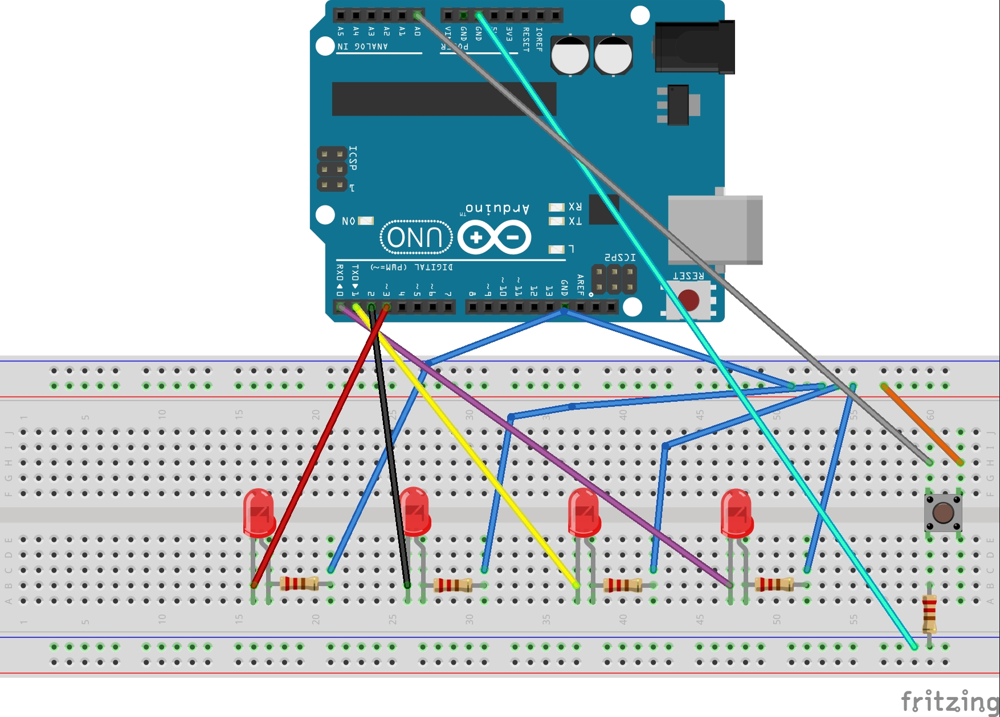

# micro-3rd-project

##  پوشه شماره 1 : روشن و خاموش شدن  LED به وسیله دکمه
در این برنامه کدی نوشتیم که بتوانیم با نگهداشتن دکمه LED
را روشن کنیم و بالعکس.

در ابتدای این کد ما متغیر و پین های مورد نیازمان را تعریف کرده ایم و خروجی و ورودی ها را مشخص کرده ایم.
سپس در تابع loop تعریف کرده ایم که اگر دکمه ما فشرده شد LED روشن و در غیر این صورت LED خاموش شود.

**در پوشه ***Shematic*** شما میتوانید مدار این آزمایش را ببینید.**


## پوشه شماره 2 : روشن و خاموش شدن LED به وسیله دکمه

این آزمایش کاملا شبیه به آزمایش شماره 1 است با این تفاوت که اگر وضعیت دکمه LOW باشد، LED روشن می‌شود.
اگر وضعیت دکمه HIGH باشد، LED خاموش می‌شود.
در این حالت، LED زمانی روشن می‌شود که دکمه فشرده نشده باشد و در حالت LOW قرار داشته باشد.

در واقع تفاوت اصلی در این است که در آزمایش اول دکمه برای روشن شدن LED باید فشرده شود، اما در آزمایش دوم دکمه برای روشن ماندن LED نباید فشرده شود.

و تفاوت دیگر همانطور که در مدار هم میبینید در نوع متصل کردن سیم ها است که در اینجا ما از پایه مقاومت به پایه 5 ولت برد آردوینو وصل میکنیم و از ```button```(دکمه) به ```GND```(زمین) وصل میکنیم.

**در پوشه ***Shematic*** شما میتوانید مدار این آزمایش را ببینید.**

## رقص نور با چهار LED

این کد برای اجرای یک الگوی ```رقص نور``` با چهار LED نوشته شده است. زمانی که دکمه‌ای که به پین A0 متصل است فشرده می‌شود، یک سری الگوهای روشن و خاموش شدن LEDها اجرا می‌شود. این الگوها در یک آرایه دو‌بعدی ذخیره شده‌اند و به ترتیب هر LED طبق الگوهای مشخص روشن و خاموش می‌شود. هر الگو پس از یک وقفه‌ی کوتاه (200 میلی‌ثانیه) تغییر می‌کند. اگر دکمه فشرده نشود، همه LEDها خاموش می‌مانند.

**در پوشه ***Shematic*** شما میتوانید مدار این آزمایش را ببینید.**



